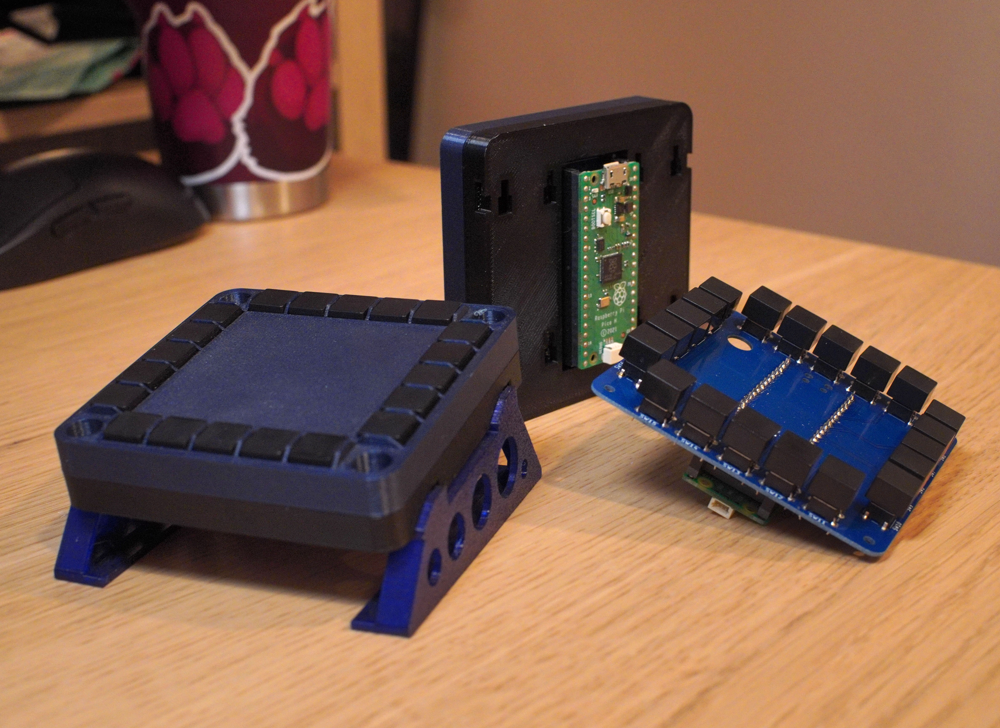

# uMFD: A small button pad for Pico

This is a version 1.0 of my small mfd controller.

This repo contains the blender files for the case, along with kicad files for
the button carrier PCB, and the source code for the gamepad software.

The completed project appears as an xinput device where each of the 20 buttons
it its own digital input.

## Building

1. `mkdir build`
2. `cmake -B build`
3. `make -C build`
4. "Where is the final image?"
5. `find -name '*.uf2'`
